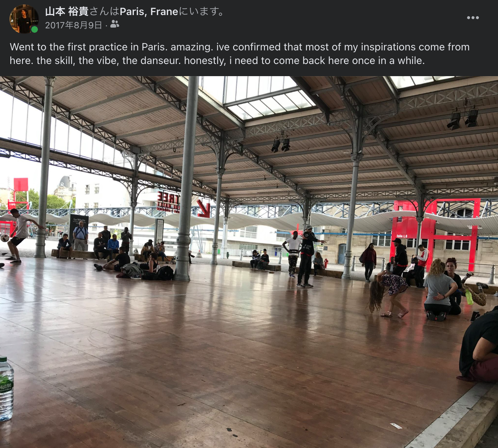

いきなりですが、私は今日からフランス・パリで新たに生活を始めます。

なぜフランスか。

遡ること7年前。

当時高校生だった私は、Youtubeで流行っていたアニメーションダンスにのめり込んでいました。
高校3年生になった時にふとフランス出身のダンサーのバトル動画を見つけ、『ヒップホップダンス』を目の当たりにしました。

<iframe width="560" height="315" src="https://www.youtube.com/embed/928or5ET2Tc" title="YouTube video player" frameborder="0" allow="accelerometer; autoplay; clipboard-write; encrypted-media; gyroscope; picture-in-picture" allowfullscreen></iframe>

彼から滲み出る動きの鋭さと溢れる音楽性に惹かれ、帰りのホームルームで何度も動画を再生していたのを憶えています。

その一年後に来日した彼のダンスを生で体感し、ヨーロッパのヒップホップダンスの良さを再確認。
フランス出身の彼がきっかけで、フランスを中心とするユーロヒップホップにすっかり夢中になっていました。

2017年、アメリカへ大学留学する直前にヨーロッパを周遊し、ユーロヒップホップにのめり込むきっかけとなったバトルに挑戦。予選敗退。

日本にいるだけでは知り得なかった猛者を目の当たりにしたと同時に、この時パリのダンスシーンに初めて足を踏み入れ、ヨーロッパのダンスの芸術性の高さを再認識しました。

その後ペンシルベニア州のフィラデルフィアに住むことに。
ヒップホップが生まれた国であるアメリカはヨーロッパとはまた違い、
ヒップホップが文化として生活に根付いていてダンスに限らずヒップホップの歴史自体に興味が湧くきっかけとなりました。

その後日本に帰国。

日本がダンスにおいてどのくらいの立ち位置にいるかというと、「世界でダンス大国を3つあげるとしたら？」と聞くとアメリカ、日本、フランスと言う人が多い。そのくらい、日本のダンスシーンは盛んで海外からも高い評価を受けています。ヒップホップが生まれて早い段階で第一人者が来日して技術を継承したことから、特に基礎となるスキルやクオリティの高さは世界の中でも一際秀でています。

ただ、ヒップホップの文化という側面においては生みの親であるアメリカや移民が多いフランスで目覚ましい発展をし続けています。

私はヒップホップという文化を体感し表現したい。
いずれはアメリカへ渡りたいが、その前にきっかけとなったフランスに行きたい。

そんな気持ちで今回の渡仏に踏み切りました。

今回は日本からフルリモートでフランスの会社への転職活動を行ったので、これについては生活が落ち着いたら備忘録としてnoteにでもシェアしようと思っています。

また、嬉しいことに今年入籍したので独り身ではなく家族で新生活を始めることとなりました。

冬が近づいているのでみなさま暖かくするのを忘れず、お身体にお気をつけください。
