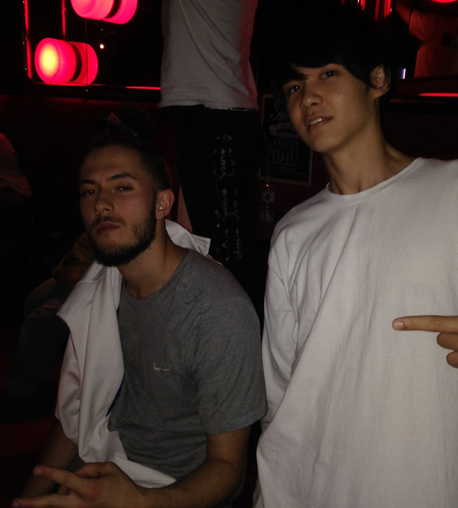

いきなりですが、私は来週よりフランス・パリで新たに生活を始めます。

なぜフランスか。

遡ること7年前。
周りが大学受験ムードの中、アニメーションダンスをしていた自分が出会ったダンスバトルの動画をたまたま見つけて衝撃が走りました。

<iframe width="560" height="315" src="https://www.youtube.com/watch?v=928or5ET2Tc" title="Waydi vs Kefton" frameborder="0" allow="accelerometer; autoplay; clipboard-write; encrypted-media; gyroscope; picture-in-picture" allowfullscreen></iframe>

彼から滲み出る動きの鋭さと溢れる音楽性に惹かれ、気づいたら帰りのホームルームで何度も動画を再生していたのをおぼえています。
その一年後に来日した彼のダンスを生でみてヤバさを再確認。
フランス出身の彼がきっかけで、フランスを中心とするヨーロッパのヒップホップダンスにすっかりのめり込んでいきました。

2017年、アメリカへ留学する前にヨーロッパを周遊し、きっかけとなったオランダのバトルに挑戦。予選敗退。
日本にいるだけでは知り得なかった猛者を目の当たりにしたと同時に、ヨーロッパのダンスの芸術性の高さを再認識しました。

ヒップホップが生まれたアメリカでは、ヨーロッパとまた違った刺激を受けました。
ダンスに限らずヒップホップが文化として根付いていて、