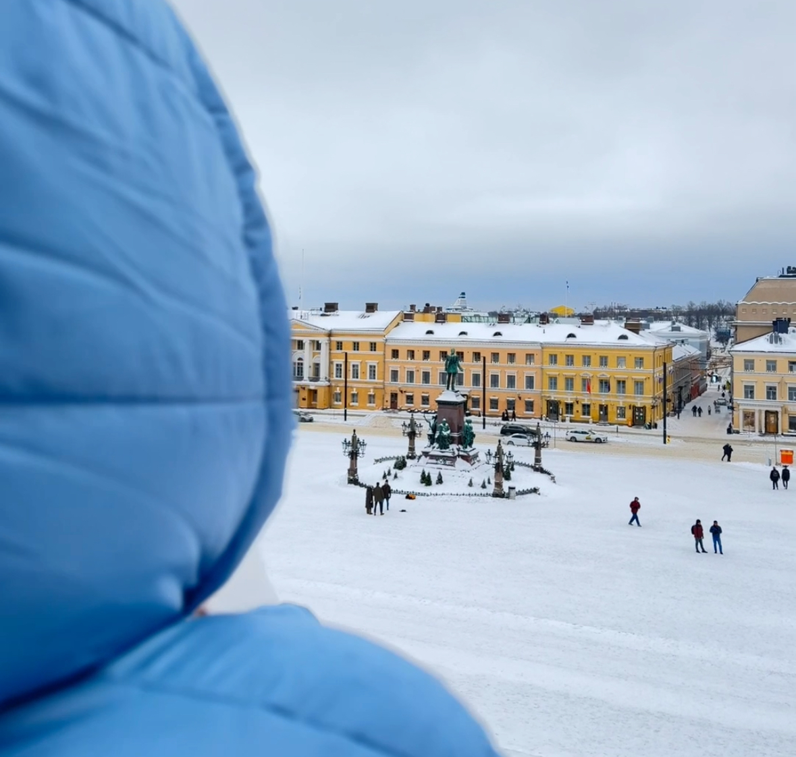

先月コペンハーゲン、ストックホルム、ヘルシンキの3都市へ旅行に行った。  
雪が積もっていて、いわゆる『北欧』と呼ばれる雰囲気を感じられて充実した旅だった。  
ハイライトを書いて旅の記録としたいと思う。

ヘルシンキ大聖堂からの景色

### いちおしはコペンハーゲン

三都市の中で一番住むのが想像できたのがコペンハーゲンだった。  
ほどよい都会感と食のクオリティの高さ、そして整備されている自転車道を見るとなんとなく住むイメージが出来た。いい街だ。

### おいしいコーヒー

各都市でコーヒー屋を回ったところ、一番のお気に入りはコペンハーゲンのPrologというお店だった。美味しくて滞在中には2回も足を運んだ。

<iframe src="https://www.google.com/maps/embed?pb=!1m18!1m12!1m3!1d9000.761438650861!2d12.54126798100444!3d55.668289846283415!2m3!1f0!2f0!3f0!3m2!1i1024!2i768!4f13.1!3m3!1m2!1s0x4652537389663047%3A0x48121d91d9c515a9!2sProlog%20Coffee%20Bar%20Meatpacking%20District!5e0!3m2!1sfr!2sfr!4v1707342363973!5m2!1sfr!2sfr" width="400" height="130" style="border:0;" allowfullscreen="" loading="lazy" referrerpolicy="no-referrer-when-downgrade"></iframe>

### うつくしい図書館

ヘルシンキ中央図書館が非常に美しく、魅力的だった。
モダンな建築で美しい建物であるだけでなく、作業にもってこいな作業室やDJの練習室を兼ね備えていたりと、スペックが素晴らしかった。空間が与える影響はとても大きい。

### あたたかいアプリ

滞在中の気候は総じて寒かったものの、各国の交通機関のアプリは非常に使いやすく、そのデザインになんだか温かみを感じた。
以前ノルウェーを訪れた際、その国の交通機関のソフトウェアのデザインが全体的に綺麗であることに気付き、他の北欧の国もそうなのかもとは思っていた。

<a href="https://t.co/lJ9YXm8cpX"><blockquote class="twitter-tweet">
Loving the software design for transportation apps in Oslo 💞 <a href="https://t.co/lJ9YXm8cpX">pic.twitter.com/lJ9YXm8cpX</a>
&mdash; Yuki (@redryerye) <a href="https://twitter.com/redryerye/status/1604631493149605889?ref_src=twsrc%5Etfw">December 19, 2022</a></blockquote></a> 

コペンハーゲンのアプリは、初めてでも直感的にチケットが購入できた。ゾーンごとのチケットの適用範囲がマップと連動して表示されるので、異なるチケットの違いが一目で理解できる。

  <video src="dot-app.mp4" controls width="230"></video>

DOT Tickets App

ストックホルムのアプリは、全体的にシンプルなデザインだが、必要に応じて色を加えることで重要な情報に目がいく。この色のトーンがまたいい。

  <video src="sl-simple.mp4" controls width="230"></video>

また、有効時間内のチケットがある状態でこのアプリを起動するとチケット画面が開く。
基本的なことだけど動線がしっかり考慮されているのが分かる。  

上部にあるチケットの有効を表す緑のアニメーションも分かり易い。

  <video src="sl-ticket.mp4" controls width="230"></video>

SL App

デザイン全体に温かみがあって、青色の中でも冷たさを感じないような優しい色合いや、親しみやすいフォントが使われている。  

フランスや日本の交通機関アプリはミニマムで機械的で、明朝体までいかないがレガシー感残る印象だったので、北欧でのこのデザインに驚いた。

どんな方たちが作ってるのか気になって調べてみると、北欧に拠点を置く会社が、特にユーザ体験に焦点を当て、入念なユーザリサーチを重ねた結果、[このアプリが生まれたそうだ](https://nitor.com/en/articles/the-new-sl-app-makes-public-transportation-more-accessible-for-everyone-in)。
なぜこの会社が受注することになったか気になるが、そもそもミニマリズム、機能性、自然を重視する[北欧デザイン](https://ja.wikipedia.org/wiki/%E5%8C%97%E6%AC%A7%E3%83%87%E3%82%B6%E3%82%A4%E3%83%B3)が浸透しているという事実が影響しているのかもしれない。

今年は自分の「好き」をもう少し言語化できるようになりたいので、いいヒントが見つかった、そんな旅だった。