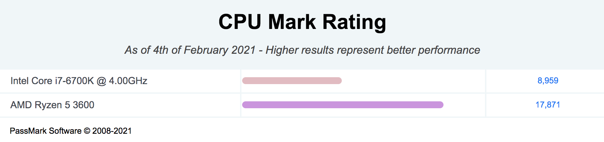
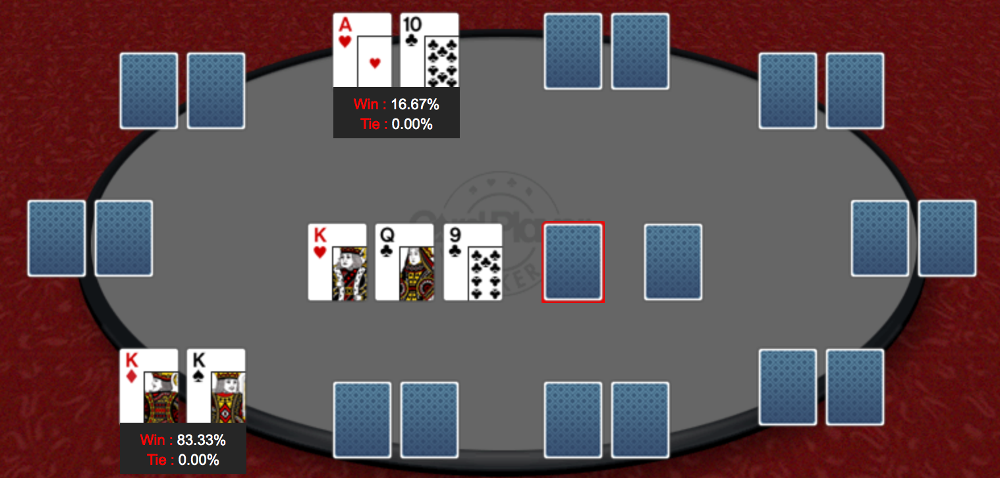

先週末はポーカーして放置していた自作PCアップグレードしたいい週末だったので今週末が来る前に書く。

# 自作PCが壊れた

２ヶ月くらい前のこと。急に自作PCの電源がつかなくなってしまった。

たまに電源は入るけどBIOSは起動しないという状態で、電源かマザボの問題だと疑った。

CMOSクリアしても変わらなかったので、とりあえずマザボを替えてみる事を決意。
あと、今までIntel Core i7-6700KだったCPUもこの際最近アツアツのRyzenにしてしまおうと。

替えた結果、無事BIOSがお見えになったので成功。

以下、PCの現在のSpecになります。
- CPU - Ryzen 5 3600 (New!)
- GPU - GeForce GTX 1060
- Motherboard - MSI B450 (New!)
- SSD - 256GB
- HHD - 3TB
- Memory - 64GB

Intel Core i7-6700K Vs. Ryzen 5 3600

Ryzenはモデルによってピンきりで、あまり出費を許容できなかったのでお財布と相談してRyzen 5 3600に決めた。

CPUの性能を比較すると約二倍にになった。良き。

# ポーカーで負けた
ポーカーをしに行った。

$300スタートで、$1/$3。
その日最後の手がKKで、プロフロップレイズしてHeads Upに。自分の手持ちは$30弱。

フロップがQ-K-9、
$25BetされたのでAll in。向こうはCall。A10持ち。

TurnはBlank。

そしてRiverにJが来て終了。

スリーカードでほぼ確だと思ってたけど、勝率83%か。。

降りていたとしてその後にKKより良い手が来る確率考えたらここでAll Inは間違いではないか？

反省点として、Bet額と持ち手をはっきり覚えていないのでちゃんとメモろう。
