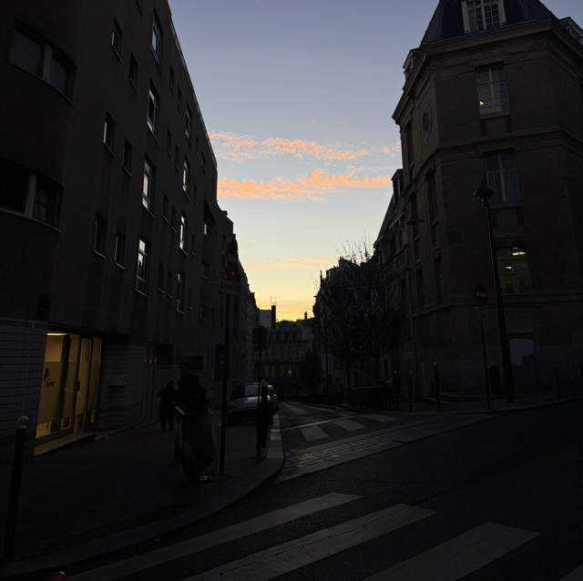
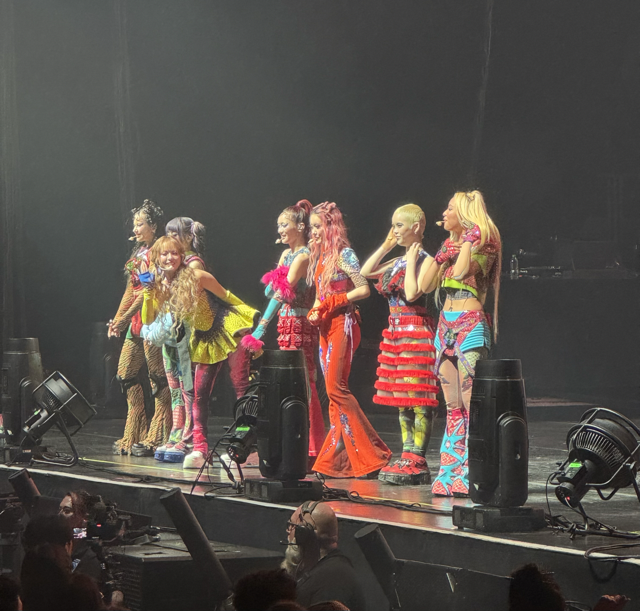

すっかり冬になった。先日パリでは雪が一日だけ降って、少し早めのクリスマス気分を味わうことが出来た。

冬晴れっていいな

## XG のライブに行った

お誘いをうけたので XG というヒップホップ・RNB アーティストのライブに行ってきた。
チケットはお友だちに取ってもらった。最近人気が急上昇しているらしく、席はどんどんと埋まっていった。ライブは[Zenith Paris](https://maps.app.goo.gl/HCfG4ScBVrFfx8VH8)という 7,000 人規模の会場で行われた。

私は元々彼女たちのファンだった訳ではなかった。そのため、彼女たちを知るために[オーディション番組](https://www.youtube.com/watch?v=Ur0L9aKNXiI)をしっかり見て予習から行った。オーディションドキュメンタリーは中々考えさせられるような内容で、複雑な感情が入り交じる中会場へ足を運んだ。20 時公演スタートだったので 19 時くらいには会場に着いて入場するために列に並んだ。この会場に行くのは少し緊張した。過去にデオドラントを持って入ろうとしたらセキュリティの方に何も聞かれずに速攻で捨てられた。そのため今回は持ち物はなるべく軽くした。結果、私の持ち物とお別れすることはなく、無事入場出来た。

ライブの内容への感想は割愛するが、総じてライブが始まるまでのワクワク感やみんなで盛り上がるライブ中の雰囲気などが非日常的でとても楽しい時間を過ごせた。

彼女たちのほとんどの曲は一回聞いただけで耳に残る。そのため、ライブの日以来彼女たちの曲をリピートしている。

次のリリースは来年かな。

衣裳が素敵で輝いていた

## パリに来て 2 年が経った

渡仏して 2 年が経ったこと祝うために家族でムーラン・ルージュに行ってきた。

老舗と言われるだけあってショーの内容は中々クオリティが高かった。エストニアからいらっしゃったカップルと同席して小話なんかをした。彼らはその翌日、ムーラン・ルージュよりも前衛的なキャバレーと言われている Crazy Horse を観に行くらしく、機会があれば行ってみたいと思った。

この二年間大きなトラブルもなく 2 年間健康に過ごすことが出来た。そんな自分たちを称えたい。

ただ同時に二年間、日本にいる両親や友人に会えていない。もうすぐ日本に行く予定があるのでしっかりみんなの顔を見てパリに帰ってきたい。
